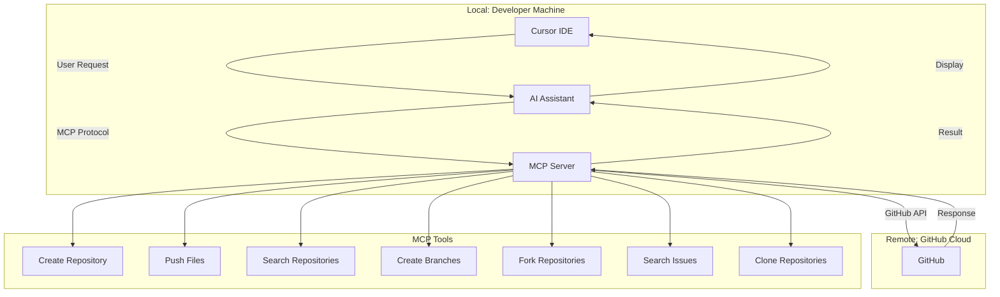

# Cursor MCP for GitHub

This repository contains the setup for the Model Context Protocol (MCP) server that enables GitHub operations directly from within Cursor IDE.

## What is MCP?

The Model Context Protocol (MCP) is a powerful tool that allows AI assistants in Cursor to interact with external services like GitHub. It enables you to perform GitHub operations such as creating repositories, pushing code, searching issues, and more without leaving your IDE.

## Features

- Create and manage GitHub repositories
- Push files and code changes
- Search repositories and users
- Create and manage branches
- Fork repositories
- Search issues and code
- Clone repositories
- And much more!

## Installation Guide

### Prerequisites

- Cursor IDE installed
- GitHub account
- GitHub Personal Access Token with `repo` scope

### Step-by-Step Setup

1. **Generate a GitHub Personal Access Token**
   - Go to GitHub → Settings → Developer Settings → Personal Access Tokens → Tokens (classic)
   - Click "Generate new token" → "Generate new token (classic)"
   - Name your token (e.g., "Cursor MCP")
   - Set an expiration date
   - Select the `repo` scope (this gives access to all your repositories)
   - Click "Generate token"
   - **IMPORTANT**: Copy the token immediately as GitHub will only show it once

2. **Create a Shell Script**
   - Create a new file called `run.sh` in your preferred location
   - Add the following content to the file (replace `YOUR_GITHUB_TOKEN` with your actual token):

   ```bash
   #!/bin/bash
   export GITHUB_PERSONAL_ACCESS_TOKEN="YOUR_GITHUB_TOKEN"
   npx @modelcontextprotocol/server-github
   ```

3. **Make the Script Executable**
   - Open your terminal and run:
   ```bash
   chmod +x /path/to/run.sh
   ```

4. **Add MCP Server to Cursor**
   - Open Cursor Settings
   - Navigate to the MCP section
   - Click "Add a new MCP server"
   - Name: "GitHub MCP" (or any name you prefer)
   - Type: Command
   - Command: `bash /path/to/run.sh` (use the full path to your script)
   - Click "Add"

5. **Enable Agent Mode**
   - Make sure Agent Mode is enabled in Cursor for MCP to work

## How MCP Works



> **Note:**
> - **Local**: The Cursor IDE, AI Assistant, and MCP Server all run on your local development machine during development.
> - **Remote**: GitHub is a remote cloud service.
>
> If you want to host the MCP server remotely (e.g., on a cloud VM or server), you can deploy the contents of this repo and run `run.sh` on your remote machine. Make sure to:
> - Set up secure access (e.g., firewall, authentication).
> - Update your Cursor MCP configuration to point to the remote server's address and port.
> - Never expose your GitHub token or server to the public internet without proper security controls.

## Usage Examples

### Creating a Repository

Simply ask the AI assistant to create a repository:

```
Create a repository called "my-project"
```

### Adding Files to a Repository

```
Add a README.md file to the my-project repository with the content "# My Project"
```

### Searching for Repositories

```
Search for repositories related to machine learning
```

## Troubleshooting

- **MCP Server Not Responding**: Make sure your GitHub token is valid and has the correct permissions
- **Command Not Found**: Ensure the path to your script is correct in the Cursor MCP settings
- **Permission Denied**: Check that your script has execute permissions (`chmod +x /path/to/run.sh`)

## Resources

- [Official MCP GitHub Repository](https://github.com/modelcontextprotocol/servers)
- [Cursor IDE Documentation](https://cursor.sh/docs)
- [GitHub API Documentation](https://docs.github.com/en/rest)

## License

This project is licensed under the MIT License - see the LICENSE file for details.

## Where is the MCP Server Hosted?

The MCP server is hosted **locally** on your machine whenever you run the `run.sh` script. This means the server is not running on a remote cloud or public server, but instead starts up on your own computer each time you execute:

```bash
bash /full/path/to/run.sh
```

- The exact location of the server is determined by the path to your `run.sh` script. For example, if you placed it in `/Users/yourusername/mcp/run.sh`, then that is where the server will be started from.
- You can change the location of the script as needed, but make sure to update your Cursor MCP configuration to match the new path.
- The server will only be running while the script is active in your terminal session.

**Note:** The server is not accessible from the public internet unless you specifically configure your network and firewall to allow it (not recommended for most users). 
