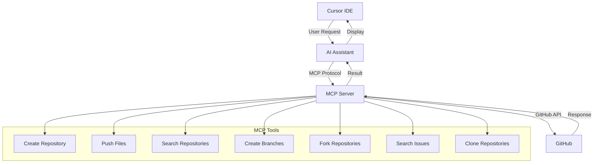

# Cursor MCP for GitHub

This repository contains the setup for the Model Context Protocol (MCP) server that enables GitHub operations directly from within Cursor IDE.

## What is MCP?

The Model Context Protocol (MCP) is a powerful tool that allows AI assistants in Cursor to interact with external services like GitHub. It enables you to perform GitHub operations such as creating repositories, pushing code, searching issues, and more without leaving your IDE.

## Features

- Create and manage GitHub repositories
- Push files and code changes
- Search repositories and users
- Create and manage branches
- Fork repositories
- Search issues and code
- Clone repositories
- And much more!

## Installation Guide

### Prerequisites

- Cursor IDE installed
- GitHub account
- GitHub Personal Access Token with `repo` scope

### Step-by-Step Setup

1. **Generate a GitHub Personal Access Token**
   - Go to GitHub → Settings → Developer Settings → Personal Access Tokens → Tokens (classic)
   - Click "Generate new token" → "Generate new token (classic)"
   - Name your token (e.g., "Cursor MCP")
   - Set an expiration date
   - Select the `repo` scope (this gives access to all your repositories)
   - Click "Generate token"
   - **IMPORTANT**: Copy the token immediately as GitHub will only show it once

2. **Create a Shell Script**
   - Create a new file called `run.sh` in your preferred location
   - Add the following content to the file (replace `YOUR_GITHUB_TOKEN` with your actual token):

   ```bash
   #!/bin/bash
   export GITHUB_PERSONAL_ACCESS_TOKEN="YOUR_GITHUB_TOKEN"
   npx @modelcontextprotocol/server-github
   ```

3. **Make the Script Executable**
   - Open your terminal and run:
   ```bash
   chmod +x /path/to/run.sh
   ```

4. **Add MCP Server to Cursor**
   - Open Cursor Settings
   - Navigate to the MCP section
   - Click "Add a new MCP server"
   - Name: "GitHub MCP" (or any name you prefer)
   - Type: Command
   - Command: `bash /path/to/run.sh` (use the full path to your script)
   - Click "Add"

5. **Enable Agent Mode**
   - Make sure Agent Mode is enabled in Cursor for MCP to work

## How MCP Works



## Usage Examples

### Creating a Repository

Simply ask the AI assistant to create a repository:

```
Create a repository called "my-project"
```

### Adding Files to a Repository

```
Add a README.md file to the my-project repository with the content "# My Project"
```

### Searching for Repositories

```
Search for repositories related to machine learning
```

## Troubleshooting

- **MCP Server Not Responding**: Make sure your GitHub token is valid and has the correct permissions
- **Command Not Found**: Ensure the path to your script is correct in the Cursor MCP settings
- **Permission Denied**: Check that your script has execute permissions (`chmod +x /path/to/run.sh`)

## Resources

- [Official MCP GitHub Repository](https://github.com/modelcontextprotocol/servers)
- [Cursor IDE Documentation](https://cursor.sh/docs)
- [GitHub API Documentation](https://docs.github.com/en/rest)

## License

This project is licensed under the MIT License - see the LICENSE file for details. 